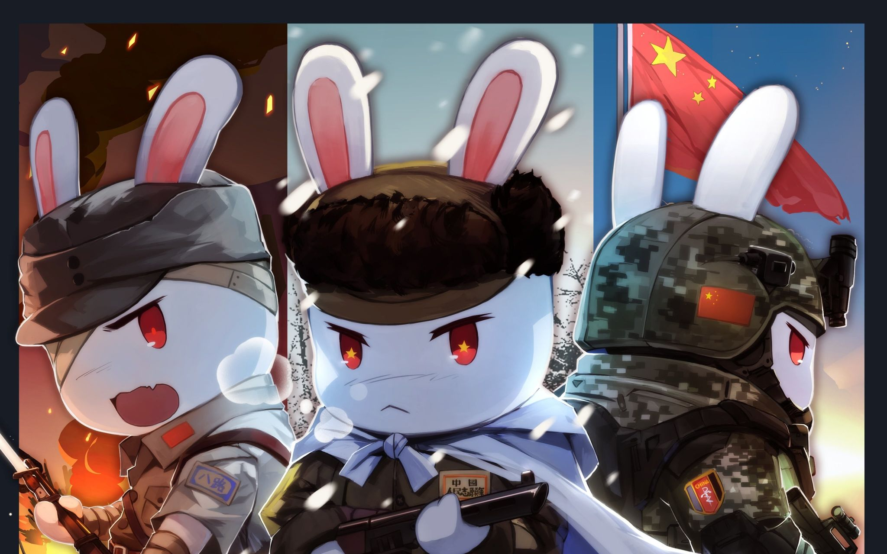

## **个人简介**

​	我是Rico，来自中国-湖北-黄冈，出生于1999年。目前就读于重庆邮电大学通信与信息学院，在读硕士研二，研究方向：深度学习、目标检测、信道估计等。

## **个人兴趣爱好**

​	生活爱好：万物皆可为都是生活的一部分，亦可成为缺一不可的一份子。恐慌和焦虑的产生总是因为自身的现状满足不了欲望，活在当下是一种奢侈，致力于热爱生活、乐于助人（热血青年）。

​	科研爱好：目标检测、图像与视频重建、多模态模型、GPT、AI生成、仿生神经网络等，科研梦想：Neural Baby（元婴）。

​	游戏爱好：红色警戒、魔兽争霸、星际争霸、王者荣耀（荣耀）、DOTA自走棋、和平精英（王牌）、云顶之弈、金铲铲（大师）、宝可梦系列（红绿蓝宝石、剑盾）等。

​	动漫爱好：洛洛历险记、果宝特攻、神奇宝贝、游戏王、斩赤红之瞳、刺客伍六七、一人之下、咒术回战、鬼灭之刃等。

