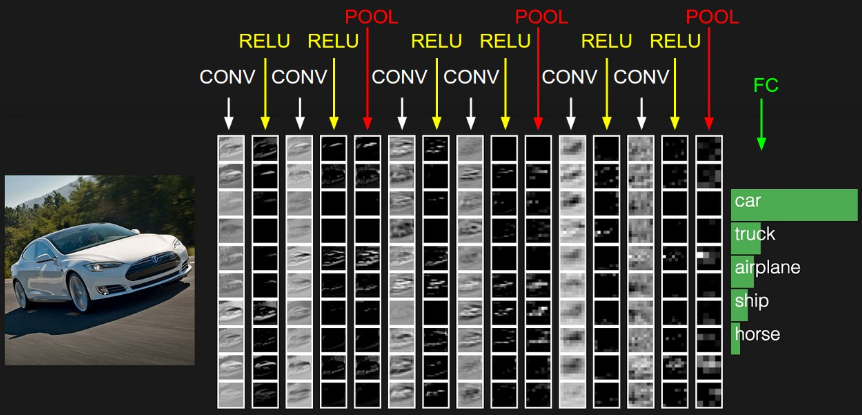
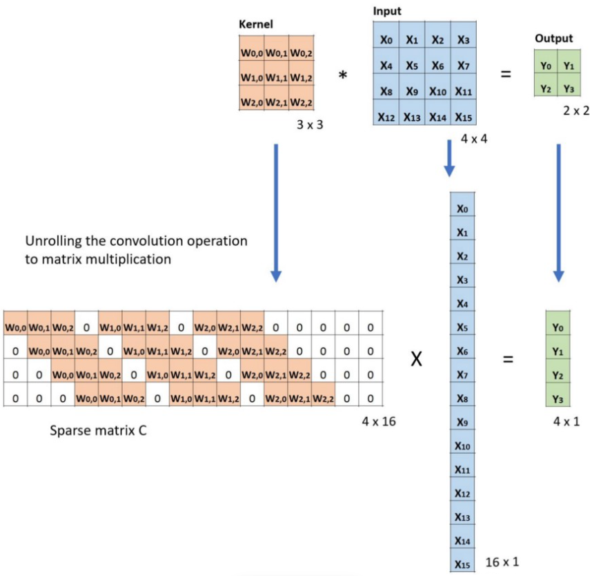

+++
author = "Rico0807"
title = "CNN家族发展史"
date = "2023-06-03"
description = "本篇博客主要介绍卷积神经网络CNN家族发展史"
tags = [
	"CNN",
	"卷积神经网络"
]
series = ["Themes Guide"]
aliases = ["migrate-from-jekyl"]
image = "1.jpg"

+++

## CNN家族发展史

### 1.	卷积神经网络	CNN

> ​	上图中CNN组成的层级网络，最左边是网络的输入层，对数据做一些处理，比如去均值（把输入数据各个维度都中心化为0，避免数据过多偏差，影响训练效果）、归一化（把所有的数据都归一到同样的范围）、PCA/白化等等。
>
> ​	中间包括：ConV层、Relu激活函数层、Pool池化层、FC全连接层。其中，卷积层用于卷积核的矩阵线性乘积求和；激活函数层将卷积层输出的特征图进行线性或非线性映射，增强网络拟合能力；池化层一般用于降低特征图尺寸大小，取区域平均或者最大；全连接层用于将线性特征映射至输出。

>    ​	在对图像对应的卷积计算过程中，输入是一定区域大小（width * height）的数据，和滤波器 filter（带着一组固定权重的神经元）做内积后等到新的二维数据。
>
>    ​	 具体来说，左边是图像输入，中间部分就是滤波器filter（带着一组固定权重的神经元），不同的滤波器filter会得到不同的输出数据，比如颜色深浅、轮廓。相当于如果想提取图像的不同特征，则用不同的滤波器filter，提取想要的关于图像的特定信息：颜色深浅或轮廓。
>
>       在CNN中，滤波器filter（带着一组固定权重的神经元）对局部输入数据进行卷积计算。每计算完一个数据窗口内的局部数据后，数据窗口不断平移滑动，直到计算完所有数据。这个过程中，有这么几个参数： 
>
>    （1）通道数：神经元个数，决定输出的depth厚度。同时代表滤波器个数。
>
>    （2）步长：决定滑动多少步可以到边缘。
>
>    （3）填充：在外围边缘补充若干圈0，方便从初始位置以步长为单位可以刚好滑倒末尾位置，通俗地讲就是为了总长能被步长整除。 

> 卷积层输出特征图大小的计算（向上取整）：
>
> （1）valid
>
> ​	valid模式及正常有效模式，在这种模式下输出特征图的尺寸将减小。
>
> 
>
> （2）same
>
> same模式及填充模式，在这种模式下（stride=1）输出特征图的尺寸将保证和输入相同。
>
> 
>
> ​	其中same模式下，新特征图的尺寸为输入尺寸除以步进stride大小，那么需要padding的个数计算表达式为：2×padding_num = (output_size - 1)×strides + filter_size - inputl_size。
>
> **感受野的计算：**
>
> ​	卷积层(conv)和池化层(pooling)都会影响感受野，而激活函数层通常对于感受野没有影响，当前层的步长并不影响当前层的感受野，感受野和填补(padding)没有关系，感受野计算方式：
>
> 
>
> ​	其中，lk、lk-1分别为第k层和第k-1层的感受野大小，fk表示第k层卷积核大小，si表示前k-1层的步进stride，并计算其累积。感受野的计算是逐层进行的，以下表中的网络结构为例：
>
> 
>

### 2.	空洞卷积	Dilated Convolution

> ​	空洞卷积（[**paper**](https://arxiv.org/pdf/1511.07122.pdf)）也叫扩张卷积或者膨胀卷积，简单来说就是在卷积核元素之间加入一些空格(零)来扩大卷积核的过程。
>
> 
>
> ​	假设以一个变量 a 来衡量空洞卷积的扩张系数，则加入空洞之后的实际卷积核尺寸与原始卷积核尺寸之间的关系：**K = K + (K-1)(a-1)**
>
> ​	其中**k为原始卷积核大小，a为卷积扩张率(dilation rate)**，K为经过扩展后实际卷积核大小。除此之外，空洞卷积的卷积方式跟常规卷积一样。我们用一个扩展率a来表示卷积核扩张的程度。比如说**a=1,2,4**的时候卷积核感受野如下图所示：
>
> 
>
> ​	在这张图像中，3×3 的红点表示经过卷积后，输出图像是 3×3 像素。尽管所有这三个空洞卷积的输出都是同一尺寸，但模型观察到的感受野有很大的不同。当a=1，原始卷积核size为3 * 3，就是常规卷积。a=2时，加入空洞之后的卷积核：size=3+(3-1) * (2-1)=5，对应的感受野可计算为：(2 ^(a+2))-1=7。a=3时，卷积核size可以变化到3+(3-1)(4-1)=9，感受野则增长到 (2 ^(a+2))-1=15。有趣的是，与这些操作相关的参数的数量是相等的。我们观察更大的感受野不会有额外的成本。因此，空洞卷积可用于廉价地增大输出单元的感受野，而不会增大其核大小，这在多个空洞卷积彼此堆叠时尤其有效。
>
> ​	空洞卷积一般用在下采样过程中，用于增加对特征图的感受野大小，优势在于可以保留数据的原始内部结构，以及特征图相同时，可以获得更大的感受野，更加密集的数据特征。
>

### 3.	转置卷积	Transpose Convolution

> ​	转置卷积（Transposed Convolution）在语义分割或者对抗神经网络（GAN）中比较常见，其主要作用就是做上采样（UpSampling）。转置卷积不是卷积的逆运算，转置卷积也是卷积。它只能恢复到原来特征图的大小（shape），但是矩阵数值与原来不同。转置卷积的运算步骤可以归为以下几步：[**html**](https://blog.csdn.net/ac540101928/article/details/121855744?ops_request_misc=%257B%2522request%255Fid%2522%253A%2522168576265116800225582799%2522%252C%2522scm%2522%253A%252220140713.130102334..%2522%257D&request_id=168576265116800225582799&biz_id=0&utm_medium=distribute.pc_search_result.none-task-blog-2~all~top_click~default-4-121855744-null-null.142^v88^control_2,239^v2^insert_chatgpt&utm_term=%E8%BD%AC%E7%BD%AE%E5%8D%B7%E7%A7%AF&spm=1018.2226.3001.4187)
>
> （1）在输入特征图元素间填充s-1行、列0（其中s表示转置卷积的步进）
> （2）在输入特征图四周填充k-p-1行、列0（其中k表示转置卷积的kernel_size大小，p为转置卷积的padding，注意这里的padding和卷积操作中有些不同）
> （3）将卷积核参数上下、左右翻转
> （4）做正常卷积运算（填充0，步进1）
>
> 
>
> ​	同时要保证这一矩阵的映射关系是个体—>区域的，且前后位置对应关系不变，对应于矩阵相乘的操作就又可以转化为卷积操作。从而转置卷积也被称之为逆向卷积操作，但实际上并不是在矩阵求逆，或者逆卷积，而是权重矩阵的转置（也不确切，因为值并不相同，只是形状相同）。
> 
>

### 4.	分组卷积	Group Convolution

> ​	将图一卷积的输入feature map分成组，每个卷积核也相应地分成组，在对应的组内做卷积，如上图2所示，图中分组数，即上面的一组feature map只和上面的一组卷积核做卷积，下面的一组feature map只和下面的一组卷积核做卷积。每组卷积都生成一个feature map，共生成个feature map。

### 5.	深度可分离卷积	Depthwise Seperable Convolution
> ​	一些轻量级的网络，如mobilenet中，会有深度可分离卷积，由 depth wise(DW)和 point wise(PW)两个部分结合起来，用来提取特征feature map。相比常规的卷积操作，其参数数量和运算成本比较低。
>
> ​	 对于5x5x3的输入，如果想要得到5x5x4的 Feature Map ，那么卷积核的 shape 为3x3x3x4；如果 padding=''same''，那么输出的 Feature Map为5x5x4 。
>
> 
>
> ​	卷积层共4个Filter，每个Filter包含了3个Kernel，每个Kernel的大小为3×3。因此卷积层的参数量可以用如下公式来计算（**卷积核W x 卷积核H x 输入通道数 x 输出通道数**）：3×3×3×4=108；计算量计算公式（**不进行填充时：卷积核W×卷积核H×（输入W-卷积核W+1）×（输入H-卷积核H+1）×输入通道数×输出通道数；填充时：卷积核W×卷积核H×（输入W-卷积核W+2P+1）×（输入H-卷积核H+2P+1）×输入通道数×输出通道数**）。
>
> ​	深度可分离卷积主要分为两个过程，分别为逐通道卷积（Depthwise Convolution）和逐点卷积（Pointwise Convolution）。
>
> ​	**逐通道卷积 Depthwise Convolution **的一个卷积核负责一个通道，一个通道只被一个卷积核卷积，这个过程产生的 Feature Map 通道数和输入的通道数完全一样。
>
> ​	一张5×5像素、三通道彩色输入图片（5×5×3），Depthwise Convolution首先经过第一次卷积运算，DW完全是在二维平面内进行。卷积核的数量与上一层的通道数相同（通道和卷积核一一对应）。所以一个三通道的图像经过运算后生成了3个Feature Map (如果有same padding则尺寸与输入层相同为5×5)，如下图所示。（卷积核的shape即为：卷积核W x 卷积核H x 输入通道数）
>
> 
>
> ​	其中一个Filter只包含一个大小为3×3的Kernel，卷积部分的参数个数计算如下（即为：卷积核Wx卷积核Hx输入通道数）：N_depthwise = 3 × 3 × 3 = 27。Depthwise Convolution完成后的Feature Map数量与输入层的通道数相同，无法扩展Feature Map。而且这种运算对输入层的每个通道独立进行卷积运算，没有有效的利用不同通道在相同空间位置上的Feature Map信息。因此需要Pointwise Convolution来将这些Feature Map进行组合生成新的Feature Map。
>
> ​	**逐点卷积 Pointwise Convolution** 的运算与常规卷积运算非常相似，它的卷积核的尺寸为 1×1×M，M为上一层的通道数。所以这里的卷积运算会将上一步的Map在深度方向上进行加权组合，生成新的Feature Map。有几个卷积核就有几个输出Feature Map。（卷积核的shape即为：1 x 1 x 输入通道数 x 输出通道数）。
>
> 
>
> ​	由于采用的是1×1卷积的方式，此步中卷积涉及到的参数个数可以计算为(即为：1 x 1 x 输入通道数 x 输出通道数）：N_pointwise = 1 × 1 × 3 × 4 = 12。
>
> **常规卷积**参数个数为：
>
> >  N_std = 4 × 3 × 3 × 3 = 108
>
> **Depthwise Seperable Convolution**的参数由两部分相加得到：
>
> >  N_depthwise = 3 × 3 × 3 = 27
>
> >  N_pointwise = 1 × 1 × 3 × 4 = 12
>
> >  N_separable = N_depthwise + N_pointwise = 39
>
> ​	相同的输入，同样是得到4张Feature map，深度可分离卷积的参数个数是常规卷积的约1/3。因此，在参数量相同的前提下，采用深度可分离卷积的神经网络层数可以做的更深。
>
> **常规卷积**的计算量为：
>
> >  C_std =3*3*(5-2)*(5-2)*3*4=972
>
> **Depthwise Seperable Convolution**的计算量由两部分相加得到：
>
> >  C_depthwise=3x3x(5-2)x(5-2)x3=243
>
> > C_pointwise = 1 × 1 × 3 × 3 × 3 × 4 = 108
>
> >  C_separable = C_depthwise + C_pointwise = 351
>
> ​	相同的输入，同样是得到4张Feature map，深度可分离卷积的参数个数是常规卷积的约1/3。因此，在参数量相同的前提下，采用深度可分离卷积的神经网络层数可以做的更深。

### 6.	可变形卷积	Defomable Convolution

> ​	可变形卷积（[**paper**](https://arxiv.org/pdf/1703.06211.pdf)）的是相对于标准卷积的概念而来，在标准卷积操作中卷积核作用区域始终为中心点周围标准卷积核大小的矩形区域内（如下图a所示），而形变卷积则可以是不规则的区域（如下图b，c，d所示，其中b的偏置量随机；c，d为特例，表明可变形卷积推广了尺度、长宽比和旋转的各种变换）。
>
> 
>
> 
>
> 总结：DCN的操作流程：
>
> （1） 首选，和正常的卷积神经网络一样，根据输入的图像，利用传统的卷积核提取特征图。
>
> （2） 然后，把得到的特征图作为输入，对特征图再施加一个卷积层，这么做的目的是为了得到可变形卷积的变形的偏移量。（重点）其中，偏移层是2N，因为在平面上做平移，需要改变x值和y值两个方向。
>
> （3） 最后，在训练的时候，用于生成输出特征的卷积核和用于生成偏移量的卷积核是同步学习的。其中偏移量的学习是利用插值算法，通过反向传播进行学习。
> 
> 
>
> ​	卷积单元（卷积核）对输入的特征图在固定的位置进行采样，池化层不断减小着特征图的尺寸。然而，这样做会产生一些问题，比如，卷积核权重的固定导致同一CNN在处理一张图的不同位置区域的时候感受野尺寸都相同，这对于编码位置信息的深层卷积神经网络是不合理的。因为不同的位置可能对应有不同尺度或者不同形变的物体，这些层需要能够自动调整尺度或者感受野的方法。再比如，目标检测的效果很大程度上依赖于基于特征提取的边界框，这并不是最优的方法，尤其是对于非网格状的物体而言。
>
> 
>
>
> 左图是正常卷积，右图是可变形卷积。最上面的图像是在大小不同的物体上的激活单元。中间层是为了得到顶层激活单元所进行的采样过程(可以看作是一个卷积操作，3×3卷积核对应九个点九个数最后得到上面一个点即一个数值)，左图是标准的3x3方阵采样，右图是非标准形状的采样，但是采样的点依然是3x3，符合3×3卷积的广义定义。最下面一层是为了得到中间层进行的采样区域，同理。明显发现，可变形卷积在采样时可以更贴近物体的形状和尺寸，更具有鲁棒性，而标准卷积无法做到这一点。
