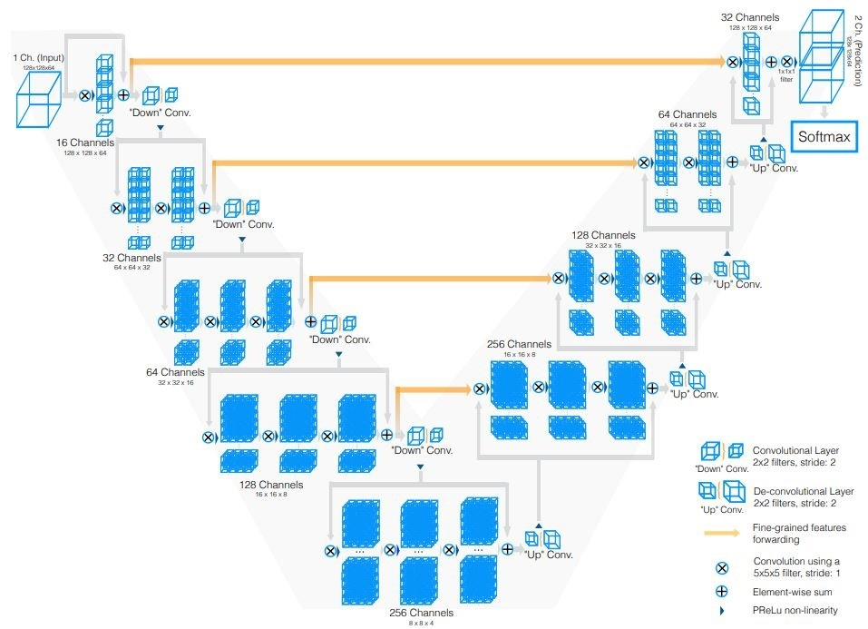

+++
author = "Rico0807"
title = "U-Net家族发展史"
date = "2023-05-25"
description = "本篇博客主要介绍U-Net家族发展史"
tags = [
	"U-Net",
]
series = ["Themes Guide"]
aliases = ["migrate-from-jekyl"]
image = "TianKongLong.jpg"

+++

## U-Net 家族发展史

**2015** 

* U-Net: Convolutional Networks for Biomedical Image Segmentation (MICCAI)   [[**paper**](https://arxiv.org/pdf/1505.04597.pdf)]

总结：
​	本文首次提出由编码路径和解码路径组成的U型结构网络，U-Net。其中，编码路径由“卷积核+激活层+池化层”组成，解码路径由“卷积层+激活层+上采样层”组成。该U型网络结构中，编码路径和解码路径通过 Skip Connection连接，以保证浅层网络中的语义信息不会丢失。

**2016** 

* V-Net: Fully Convolutional Neural Networks for Volumetric Medical Image Segmentation   [[**paper**](https://campar.in.tum.de/pub/milletari2016Vnet/milletari2016Vnet.pdf)]

总结：
​	在这项工作中，作者提出了一种基于三维全卷积神经网络的三维图像分割方法。CNN可以进行端到端的前列腺核磁共振成像的训练，并能够预测整个三维图像的分割。提出了一种新的基于Dice系数的目标函数，并在训练过程中对其进行了优化。这样就可以在解决前景和背景体素数量严重不平衡的情况。为了处理有限数量的可用于训练的标签图，使用随机非线性转换和直方图匹配来增加数据。
