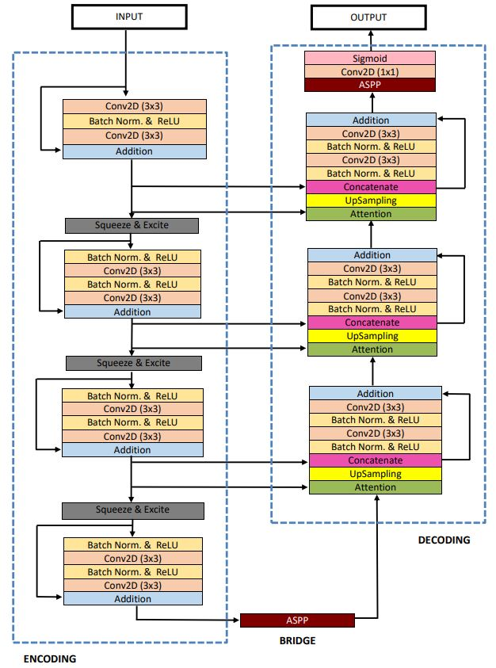

+++
author = "Rico0807"
title = "U-Net家族发展史"
date = "2023-05-25"
description = "本篇博客主要介绍U-Net家族发展史"
tags = [
	"U-Net",
]
series = ["Themes Guide"]
aliases = ["migrate-from-jekyl"]
image = "TianKongLong.jpg"

+++

## U-Net 家族发展史

**2015** 

* U-Net: Convolutional Networks for Biomedical Image Segmentation (MICCAI)  [[**paper**](https://arxiv.org/pdf/1505.04597.pdf)]

总结：
​	本文首次提出由编码路径和解码路径组成的U型结构网络，U-Net。其中，编码路径由“卷积核+激活层+池化层”组成，解码路径由“卷积层+激活层+上采样层”组成。该U型网络结构中，编码路径和解码路径通过 Skip Connection连接，以保证浅层网络中的语义信息不会丢失。

**2016** 

* V-Net: Fully Convolutional Neural Networks for Volumetric Medical Image Segmentation   [[**paper**](https://campar.in.tum.de/pub/milletari2016Vnet/milletari2016Vnet.pdf)]

总结：
​	在这项工作中，作者提出了一种基于三维全卷积神经网络的三维图像分割方法。CNN可以进行端到端的前列腺核磁共振成像的训练，并能够预测整个三维图像的分割。提出了一种新的基于Dice系数的目标函数，并在训练过程中对其进行了优化。这样就可以在解决前景和背景体素数量严重不平衡的情况。为了处理有限数量的可用于训练的标签图，使用随机非线性转换和直方图匹配来增加数据。

* 3D U-Net: Learning Dense Volumetric Segmentation from Sparse Annotation   [[**paper**](https://arxiv.org/pdf/1606.06650.pdf)]

总结：
​	这篇文章的网络结构相比于U-Net并没有什么变化，只是在数据集、训练阶段、损失上不同。

**2017** 

* H-DenseUNet: Hybrid Densely Connected UNet for Liver and Tumor Segmentation from CT Volumes (IEEE Transactions on Medical Imaging)   [[**paper**](https://arxiv.org/pdf/1709.07330.pdf)] 

总结：
​	首先，为了充分提取高水平片内的特征，使用基于二维卷积设计了一个深层和高效的网络，2D DenseU-Net，将紧密连接的路径和U-Net连接的优点融合在一起。密集连通路径是由密集连通网络(DenseNet)衍生而来的，其中改进的信息流和参数效率降低了训练深度网络的难度。与DenseNet不同，该文添加了U-Net连接，即Skip Connection。因此，该网络可以实现低层次的空间特征保存，从而更好地进行片内上下文搜索。
​	其次，为了研究目标特征的进一步表示，设计了一个端到端训练系统H-DenseUNet，该系统通过混合特征融合(HFF)层有效地提取层内和层间特征，并进行联合优化。3D DenseUNet是通过自动上下文机制与2D DenseU-Net集成的，这是堆叠共性的一般形式。在二维DenseU-Net语义概率的指导下，可以很好地减轻3D DenseU-Net的优化负担，提高了三维空间中的上下文提取的训练效率。

* GP-Unet: Lesion Detection from Weak Labels with a 3D Regression Network (MICCAI)   [[**paper**](https://arxiv.org/pdf/1705.07999.pdf)]

**2018** 

* UNet++: A Nested U-Net Architecture for Medical Image Segmentation (MICCAI)   [[**paper**](https://arxiv.org/pdf/1807.10165.pdf)]
* MDU-Net: Multi-scale Densely Connected U-Net for biomedical image segmentation   [[**paper**](https://arxiv.org/pdf/1812.00352.pdf)]
* DUNet: A deformable network for retinal vessel segmentation   [[**paper**](https://arxiv.org/pdf/1811.01206.pdf)]
* RA-UNet: A hybrid deep attention-aware network to extract liver and tumor in CT scans   [[**paper**](https://arxiv.org/pdf/1811.01328.pdf)]
* Dense Multi-path U-Net for Ischemic Stroke Lesion Segmentation in Multiple Image Modalities   [[**paper**](https://arxiv.org/pdf/1810.07003.pdf)]
* Stacked Dense U-Nets with Dual Transformers for Robust Face Alignment   [[**paper**](https://arxiv.org/pdf/1812.01936.pdf)]
* Prostate Segmentation using 2D Bridged U-net   [[**paper**](https://arxiv.org/pdf/1807.04459.pdf)]
* nnU-Net: Self-adapting Framework for U-Net-Based Medical Image Segmentation   [[**paper**](https://arxiv.org/pdf/1809.10486.pdf)]
* SUNet: a deep learning architecture for acute stroke lesion segmentation and outcome prediction in multimodal MRI   [[**paper**](https://arxiv.org/pdf/1810.13304.pdf)]
* IVD-Net: Intervertebral disc localization and segmentation in MRI with a multi-modal UNet   [[**paper**](https://arxiv.org/pdf/1811.08305.pdf)]
* LADDERNET: Multi-Path Networks Based on U-Net for Medical Image Segmentation   [[**paper**](https://arxiv.org/pdf/1810.07810.pdf)]
* Glioma Segmentation with Cascaded Unet   [[**paper**](https://arxiv.org/pdf/1810.04008.pdf)]
* Attention U-Net: Learning Where to Look for the Pancreas   [[**paper**](https://arxiv.org/pdf/1804.03999.pdf)]
* Recurrent Residual Convolutional Neural Network based on U-Net (R2U-Net) for Medical Image Segmentation   [[**paper**](https://arxiv.org/ftp/arxiv/papers/1802/1802.06955.pdf)]
* Concurrent Spatial and Channel ‘Squeeze & Excitation’ in Fully Convolutional Networks   [[**paper**](https://arxiv.org/pdf/1803.02579.pdf)]
* A Probabilistic U-Net for Segmentation of Ambiguous Images (NIPS)   [[**paper**](https://arxiv.org/pdf/1806.05034.pdf)]
* AnatomyNet: Deep Learning for Fast and Fully Automated Whole-volume Segmentation of Head and Neck Anatomy   [[**paper**](https://arxiv.org/pdf/1808.05238.pdf)]
* 3D RoI-aware U-Net for Accurate and Efficient Colorectal Cancer Segmentation   [[**paper**](https://arxiv.org/pdf/1806.10342.pdf)]
* Detection and Delineation of Acute Cerebral Infarct on DWI Using Weakly Supervised Machine Learning (Y-Net) (MICCAI)   [[**paper**](https://link.springer.com/content/pdf/10.1007%2F978-3-030-00931-1.pdf)] (Page 82)
* Fully Dense UNet for 2D Sparse Photoacoustic Tomography Artifact Removal   [[**paper**](https://arxiv.org/ftp/arxiv/papers/1808/1808.10848.pdf)]

2018年较为经典的 Res-UNet 和 Dense-UNet：

* Weighted Res-UNet for High-Quality Retina Vessel Segmentation   [[**paper**](https://ieeexplore.ieee.org/document/8589312)]

总结：
​	Res-UNet 和 Dense-UNet 分别受到残差连接和密集连接的启发，将 U-Net 的每一个子模块分别替换为具有残差连接和密集连接的形式。Res-UNet 用于视网膜图像的分割，其结构如下图所示，其中灰色实线表示各个模块中添加的残差连接

* Fully Dense UNet for 2D Sparse Photoacoustic Tomography Artifact Removal   [[**paper**](https://arxiv.org/ftp/arxiv/papers/1808/1808.10848.pdf)]

总结：
​	密集连接即将子模块中某一层的输出分别作为后续若干层的输入的一部分，某一层的输入则来自前面若干层的输出的组合。下图是 Dense-UNet 中的密集连接的一个例子。该文章中将 U-Net 的各个子模块替换为这样的密集连接模块，提出 Fully Dense UNet 用于去除图像中的伪影。

**2019** 

* MultiResUNet : Rethinking the U-Net Architecture for Multimodal Biomedical Image Segmentation   [[**paper**](https://arxiv.org/pdf/1902.04049v1.pdf)]
* U-NetPlus: A Modified Encoder-Decoder U-Net Architecture for Semantic and Instance Segmentation of Surgical Instrument   [[**paper**](https://arxiv.org/pdf/1902.08994.pdf)]
* Probability Map Guided Bi-directional Recurrent UNet for Pancreas Segmentation   [[**paper**](https://arxiv.org/ftp/arxiv/papers/1903/1903.00923.pdf)]
* CE-Net: Context Encoder Network for 2D Medical Image Segmentation   [[**paper**](https://arxiv.org/pdf/1903.02740.pdf)]
* Graph U-Net   [[**paper**](https://openreview.net/pdf?id=HJePRoAct7)]
* A Novel Focal Tversky Loss Function with Improved Attention U-Net for Lesion Segmentation (ISBI)   [[**paper**](https://arxiv.org/pdf/1810.07842.pdf)]
* ST-UNet: A Spatio-Temporal U-Network for Graph-structured Time Series Modeling   [[**paper**](https://arxiv.org/pdf/1903.05631.pdf)]
* Connection Sensitive Attention U-NET for Accurate Retinal Vessel Segmentation   [[**paper**](https://arxiv.org/pdf/1903.05558.pdf)] 
* CIA-Net: Robust Nuclei Instance Segmentation with Contour-aware Information Aggregation   [[**paper**](https://arxiv.org/pdf/1903.05358.pdf)]
* W-Net: Reinforced U-Net for Density Map Estimation   [[**paper**](https://arxiv.org/pdf/1903.11249.pdf)]
* Automated Segmentation of Pulmonary Lobes using Coordination-guided Deep Neural Networks (ISBI oral)   [[**paper**](https://arxiv.org/pdf/1904.09106.pdf)]
* U2-Net: A Bayesian U-Net Model with Epistemic Uncertainty Feedback for Photoreceptor Layer Segmentation in Pathological OCT Scans   [[**paper**](https://arxiv.org/pdf/1901.07929.pdf)]
* ScleraSegNet: an Improved U-Net Model with Attention for Accurate Sclera Segmentation (ICB Honorable Mention Paper Award)   [[**paper**](https://github.com/ShawnBIT/Paper-Reading/blob/master/ScleraSegNet.pdf)]
* AHCNet: An Application of Attention Mechanism and Hybrid Connection for Liver Tumor Segmentation in CT Volumes   [[**paper**](https://github.com/ShawnBIT/Paper-Reading/blob/master/AHCNet.pdf)]
* A Hierarchical Probabilistic U-Net for Modeling Multi-Scale Ambiguities   [[**paper**](https://arxiv.org/pdf/1905.13077.pdf)]
* Recurrent U-Net for Resource-Constrained Segmentation   [[**paper**](https://arxiv.org/pdf/1906.04913.pdf)]
* MFP-Unet: A Novel Deep Learning Based Approach for Left Ventricle Segmentation in Echocardiography   [[**paper**](https://arxiv.org/pdf/1906.10486.pdf)]
* A Partially Reversible U-Net for Memory-Efficient Volumetric Image Segmentation (MICCAI 2019)   [[**paper**](https://arxiv.org/pdf/1906.06148.pdf)]
* ResUNet-a: a deep learning framework for semantic segmentation of remotely sensed data   [[**paper**](https://arxiv.org/pdf/1904.00592v2.pdf)]
* A multi-task U-net for segmentation with lazy labels   [[**paper**](https://arxiv.org/pdf/1906.12177.pdf)]
* RAUNet: Residual Attention U-Net for Semantic Segmentation of Cataract Surgical Instruments   [[**paper**](http://xxx.itp.ac.cn/pdf/1909.10360v1)]
* 3D U2-Net: A 3D Universal U-Net for Multi-Domain Medical Image Segmentation (MICCAI 2019)   [[**paper**](https://arxiv.org/pdf/1909.06012.pdf)]
* SegNAS3D: Network Architecture Search with Derivative-Free Global Optimization for 3D Image Segmentation (MICCAI 2019)   [[**paper**](https://arxiv.org/pdf/1909.05962.pdf)]
* 3D Dilated Multi-Fiber Network for Real-time Brain Tumor Segmentation in MRI   [[**paper**](https://arxiv.org/pdf/1904.03355.pdf)]
* The Domain Shift Problem of Medical Image Segmentation and Vendor-Adaptation by Unet-GAN   [[**paper**](https://arxiv.org/pdf/1910.13681.pdf)]
* Recurrent U-Net for Resource-Constrained Segmentation   [[**paper**](http://openaccess.thecvf.com/content_ICCV_2019/papers/Wang_Recurrent_U-Net_for_Resource-Constrained_Segmentation_ICCV_2019_paper.pdf)]
* Siamese U-Net with Healthy Template for Accurate Segmentation of Intracranial Hemorrhage (MICCAI 2019)   [[**paper**](None)]

2019年较为经典的 Res-UNet++ 和 MutiRes-UNet：

* ResUNet++: An Advanced Architecture for Medical Image Segmentation   [[**paper**](https://arxiv.org/pdf/1911.07067.pdf)]

总结：
​	ResU-Net++ 是在 ResU-Net 基础上的改进，如果说 ResUNet 是结合了 Res-Net 和 U-Net 的优势，那么 ResUNet++ 就是在 ResUNet 的基础上，继续引入 squeeze and excitation block，ASPP 和 attention block。

* MultiResUNet : Rethinking the U-Net Architecture for Multimodal Biomedical Image Segmentation   [[**paper**](https://arxiv.org/pdf/1902.04049v1.pdf)]

总结：
​	两点创新：1. 使用 MutiRes 模块替换 UNet 中的传统卷积模块。2. 使用 ResPath 替换传统 UNet 中的简单的 skip connection。MutiRes 模块是一个残差连接的扩展，在该模块中三个 3x3 的卷积结果拼接起来作为一个组合的特征图，再与输入特征图经过 1x1 卷积得到的结果相加。

**2020** 

* U^2-Net: Going Deeper with Nested U-Structure for Salient Object Detection (Pattern Recognition 2020)    [[**paper**](https://arxiv.org/pdf/2005.09007v1.pdf)]

总结：
​	U^2-Net就是在U-Net基础上，将其编码路径和解码路径分别嵌入一个子U-Net网络，简称：套娃。优势当然在于U^2-Net具备较好的语义分割能力，但是不足处可能在于，处理速度慢、模型尺寸大等。

* UNET 3+: A Full-Scale Connected UNet for Medical Image Segmentation (ICASSP 2020)   [[**paper**](https://arxiv.org/ftp/arxiv/papers/2004/2004.08790.pdf)]

总结：
​	UNet 3+ 认为 UNet++ 尽管使用了密集的跳跃连接，但它没有充分利用好多尺度的信息，因此 UNet 3+ 提出了 full-scale skip connections。

* DoubleU-Net: A Deep Convolutional Neural Network for Medical Image Segmentation[[**paper**](https://arxiv.org/pdf/2006.04868.pdf)]

总结：
​	DC-U-Net 的作者认为多尺度的信息有利于分割精度的提升，一条 MultiRes block 提供的信息不够丰富，那就将其增加到两条，然后获取两条不同路径上的 MultiRes block 得到的特征结果，最终结果上能够有一定提升。

------------------（持续更新中，期待更精彩的U-Net内容）