+++
author = "Rico0807"
title = "目标检测相关知识"
date = "2023-05-27"
description = "本篇博客主要介绍与目标检测相关的深度学习知识"
tags = [
	"Object Detection",
]
series = ["Themes Guide"]
aliases = ["migrate-from-jekyl"]
image = "Slayer.jpg"

+++

## 目标检测（Object Detection）

### 1.	什么是目标检测
> ​	目标检测（Object Detection）的任务是找出图像中所有感兴趣的目标（物体），确定它们的类别和位置，是计算机视觉领域的核心问题之一。由于各类物体有不同的外观、形状和姿态，加上成像时光照、遮挡等因素的干扰，目标检测一直是计算机视觉领域最具有挑战性的问题。

> ​	计算机视觉中关于图像识别有四大类任务：
> （1）分类-Classification：解决“是什么？”的问题，即给定一张图片或一段视频判断里面包含什么类别的目标。
> （2）定位-Location：解决“在哪里？”的问题，即定位出这个目标的的位置。
> （3）检测-Detection：解决“在哪里？是什么？”的问题，即定位出这个目标的位置并且知道目标物是什么。
> （4）分割-Segmentation：分为实例的分割（Instance-level）和场景分割（Scene-level），解决“每一个像素属于哪个目标物或场景”的问题。

### 2.	目标检测的核心问题
> （1）分类问题：即图片（或某个区域）中的图像属于哪个类别。
> （2）定位问题：目标可能出现在图像的任何位置。
> （3）大小问题：目标有各种不同的大小。
> （4）形状问题：目标可能有各种不同的形状。

### 3.	目标检测算法分类

>​	基于深度学习的目标检测算法主要分为两类：Two stage和One stage。
>
>（1）Tow Stage
>​	先进行区域生成，该区域称之为region proposal（简称RP，一个有可能包含待检物体的预选框），再通过卷积神经网络进行样本分类。任务流程：特征提取 —> 生成RP —>分类/定位回归。常见tow stage目标检测算法有：R-CNN、SPP-Net、Fast R-CNN、Faster R-CNN和R-FCN等。
>
>（2）One Stage
>​	不用RP，直接在网络中提取特征来预测物体分类和位置。任务流程：特征提取–> 分类/定位回归。常见的one stage目标检测算法有：SSD、OverFeat、RetinaNet、YOLO系列等。
>
>（3）End-to-End
>​	DETR系列算法模型，如：DETR、Deformable DETR等。

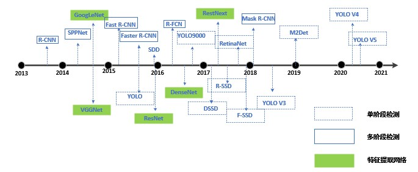

## 目标检测基本原理

>​	目标检测算法如上归类为Two Stage和One Stage，细分为RCNN系列和YOLO系列（当然，DETR是近些年崛起的，我们后续单独进行介绍）。RCNN系列是基于区域检测的代表性算法，YOLO是基于区域提取的代表性算法，另外还有著名的SSD是基于前两个系列的改进。

### 1.	生成候选区域
>​	很多目标检测技术都会涉及候选框（bounding boxes）的生成，物体候选框获取当前主要使用图像分割与区域生长技术。区域生长(合并)主要由于检测图像中存在的物体具有局部区域相似性(颜色、纹理等)。目标识别与图像分割技术的发展进一步推动有效提取图像中信息。

>（1）窗口滑动：
>​	滑窗法其主要思路：首先对输入图像进行不同窗口大小的滑窗进行从左往右、从上到下的滑动。每次滑动时候对当前窗口执行分类器(分类器是事先训练好的)。如果当前窗口得到较高的分类概率，则认为检测到了物体。对每个不同窗口大小的滑窗都进行检测后，会得到不同窗口检测到的物体标记，这些窗口大小会存在重复较高的部分，最后采用非极大值抑制(Non-Maximum Suppression, NMS)的方法进行筛选。最终，经过NMS筛选后获得检测到的物体。滑窗法简单易于理解，但是不同窗口大小进行图像全局搜索导致效率低下，而且设计窗口大小时候还需要考虑物体的长宽比。所以，对于实时性要求较高的分类器，不推荐使用滑窗法。

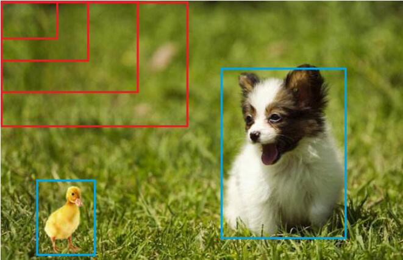

>（2）选择性搜索：
>​	滑窗法类似穷举进行图像子区域搜索，但是一般情况下图像中大部分子区域是没有物体的。学者们自然而然想到只对图像中最有可能包含物体的区域进行搜索以此来提高计算效率。选择搜索（Selective Search，简称SS）方法是当下最为熟知的图像bounding boxes提取算法，由Koen E.A于2011年提出。
>​	选择搜索算法的主要思想：图像中物体可能存在的区域应该是有某些相似性或者连续性区域的。因此，选择搜索基于上面这一想法采用子区域合并的方法进行提取bounding boxes。首先，对输入图像进行分割算法产生许多小的子区域。其次，根据这些子区域之间相似性(相似性标准主要有颜色、纹理、大小等等)进行区域合并，不断的进行区域迭代合并。每次迭代过程中对这些合并的子区域做bounding boxes(外切矩形)，这些子区域外切矩形就是通常所说的候选框
>
>基本流程包括：
>step0：生成区域集R
>step1：计算区域集R里每个相邻区域的相似度S={s1, s2,…}
>step2：找出相似度最高的两个区域，将其合并为新集，添加进R
>step3：从S中移除所有与step2中有关的子集
>step4：计算新集与所有子集的相似度
>step5：跳至step2，直至S为空

### 2.	数据表示

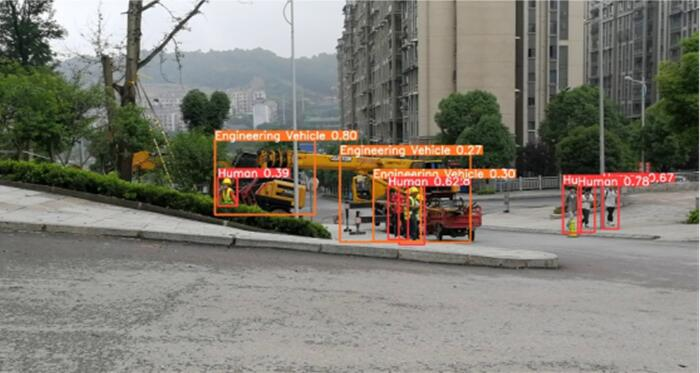

> 预测输出可以表示为:

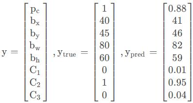

>​	其中，pc为预测结果的置信度，bx、by、bw、bh为边框坐标，C1、C2、C3为预测的类别。通过预测结果、实际结果，构建损失函数。损失函数包含了分类、回归两部分组成。

### 3.	指标评估
>​	使用IoU（Intersection over Union，交并比）来判断模型的好坏。所谓交并比，是指预测边框、实际边框交集和并集的比率，一般约定0.5为一个可以接受的值。

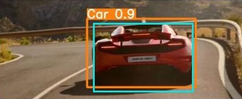

### 4.	非极大值抑制
>​	预测结果中，可能多个预测结果间存在重叠部分，需要保留交并比最大的、去掉非最大的预测结果，这就是非极大值抑制（Non-Maximum Suppression，简写作NMS）。如下图所示，对同一个物体预测结果包含三个概率0.8/0.9/0.95，经过非极大值抑制后，仅保留概率最大的预测结果。

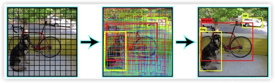

>​	在对目标产生预测框后，往往会产生大量冗余的边界框，因此我们需要去除位置准确率低的边界框，保留位置准确率高的边界框。抑制非极大值的目标（Non-maximum suppression，NMS）的主要步骤为：
> （1）对于每个种类的置信度按照从大到小的顺序排序，选出置信度最高的边框。
> （2）遍历其余所有剩下的边界框，计算这些边界框与置信度最高的边框的IOU值。如果某一边界框和置信度最高的边框IOU阈值大于我们所设定的IOU阈值，这意味着同一个物体被两个重复的边界框所预测，则去掉这这个边框。
> （3）从未处理的边框中再选择一个置信度最高的值，重复第二步的过程，直到选出的边框不再有与它超过IOU阈值的边框。

## 目标检测其余问题
### 1.	Anchor 如何设置和理解
> ​	Anchor概念：图像上预设好的不同大小，不同长宽比的参照框。
> ​	使用 K-means 获取 anchor box，主要步骤如下：
> （1）随机选取 K 个 box 作为初试 anchor
> （2）使用 IOU 度量，将每个 box 分配给与其距离最近的 anchor
> （3）计算每个簇中所有 box 的宽和高均值，更新 anchor
> （4）重复（2）和（3），直到 anchor 不再变化，或者达到计算的最大迭代次数

### 2.	NMS，Soft NMS 原理和区别
> ​	NMS目的：消除多余（交叉重复）的窗口，找到最佳物体检测位置的目标框。
> ​	NMS原理：详情见上一述章节
> 
> ​	NMS 和 Soft NMS的区别：NMS在算法上更加粗暴（hard），因为NMS直接将和得分最大的 box 的 IOU 大于某个阈值的 box 的得分置零，这将导致两个重叠率较高的同一目标被识别为一个目标。Soft NMS 中将和得分最大的 box 的 IOU 大于某个阈值的 box 的得分，按照指数级衰减计算，也就是IOU大于阈值越多，得分越低。因此比阈值低一点的，其得分不至于被置零。Soft NMS 能够提升多个重叠物体检测的平均准确度(mAP)。

### 3.	漏检问题如何解决
> ​	原因：anchor 的大小和长宽比与待检测的物体尺度不一致，anchor 与物体的 IOU小于阈值
> ​	解决：
> （1）类别样本数量少：数据增强

> （2）Focal Loss，它是一个在目标检测领域常用的损失函数，它是何凯明在RetinaNet网络中提出的，解决了目标检测中**正负样本极不平衡**和**难分类样本学习**的问题。Focal Loss该损失函数降低了易分类样本的权重，聚焦在难分类样本上。

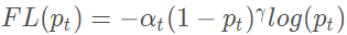

> ​	α权重因子帮助处理检测目标的类别不均衡问题，第二项（1-pt）γ是调节因子，γ大于等于0，是可调节的聚焦参数。γ控制曲线的形状，γ的值越大，好分类样本的 loss 就越小，模型的训练梯度注意力将投向那些不容易训练的样本，一个大的γ让获得小的 loss 的样本范围扩大，同时，当γ为0时，Focal Loss就退化成交叉熵损失（Cross Entropy Loss，CEL）。

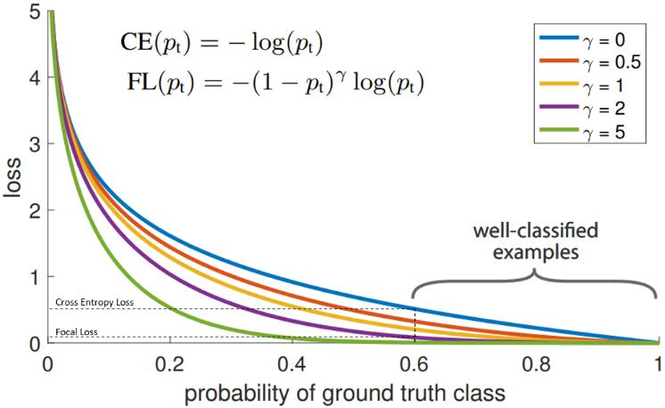

> ​	从图像中可以看出，当模型预测为真实标签的概率为0.6左右时，交叉熵损失仍在0.5左右。因此，为了在训练过程中减少损失，我们的模型将必须以更高的概率来预测到真实标签。换句话说，交叉熵损失要求模型对自己的预测非常有信心，但这也同样会给模型表现带来负面影响，导致模型的泛化能力下降。

> （3）用 K-means 设置 anchor
> ​	在YOLOV3中，锚框大小的计算就是采用的k-means聚类的方法形成的。从直观的理解，我们知道所有已经标注的bbox的长宽大小，而锚框则是对于预测这些bbox的潜在候选框，所以锚框的长宽形状应该越接近真实bbox越好。而又由于YOLO网络的预测层是包含3种尺度的信息的（分别对应3种感受野），每种尺度的anchor又是三种，所以我们就需要9种尺度的anchor，也即我们需要对所有的bbox的尺寸聚类成9种类别。

> （4）使用 FPN（Feature Pyramid Networks）网络结构
> ​	FPN主要解决的是物体检测中的多尺度问题，通过简单的网络连接改变，在基本不增加原有模型计算量的情况下，大幅度提升了小物体检测的性能。

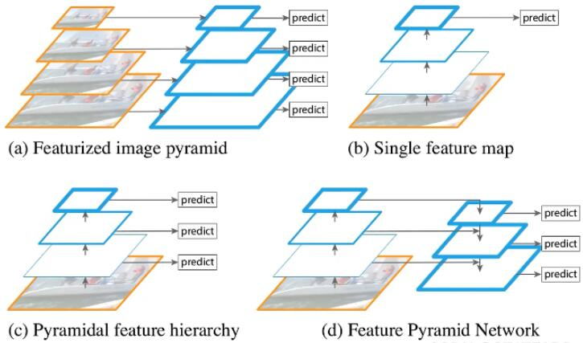

> （a）为特征图像金字塔结构，要检测不同尺度目标时会将图片进行缩放，针对每个尺度的图片都依次通过进行预测。(速度慢)
> （b）为单一特征图结构，将图片通过backbone得到最终特征图，在最终特征图上进行预测。(对小目标很不友好)
> （c）为金字塔特征层次结构，将图片输入backbone，在backbone正向传播过程中得到的不同的特征图上分别进行预测。(小目标容易被错分，但是比（c）略好一些)
> （d）为特征图金字塔网络，将不同特征图上的特征进行融合，在融合之后的特征图上再进行预测。FPN是一个利用深度卷积神经网络中固有的多尺度特征图，通过加入侧向连接和上采样，来以极小的附加计算量构建不同尺度的具有高级语义信息的特征金字塔的网络结构。
> ​	对于目标检测模型而言，FPN结构并不是模型中独立的一个模块，而是作为原始backbone的附加项，融合在卷积神经网络之中。在FPN中采用的不同的特征图需要选取都是2倍关系，例如最底层的特征图大小为28x28，则其上一层的特征图大小为14x14，最上层的为7x7。

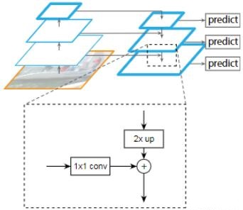

> ​	每一个特征图都会对其采用1x1的卷积层进行处理，调整backbone上不同特征图的channel，为了融合保证channel相同。对高层次的特征图进行2倍上采样，如对最上层7x7大小的特征图进行2倍上采样，得到14x14的特征图，从而保证与中间层特征图的尺寸大小相同。上两步处理后，最高层与中间层的特征图的shape完全相同，就可以进行add操作。然后将融合得到的特征图再进行2倍上采样，与经过1x1卷积后的最底层特征图进行add操作。下图是以ResNet50为backbone，输入为640x640x3的图像的FPN结构。

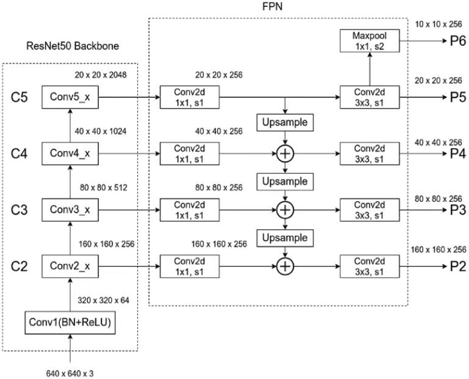

> （5） OHEM（Online Hard Example Mining）策略

### 4.	小目标物体检测如何处理

> （1）数据增强

> （2）MTCNN（Multi-task convolutional neural nerwork，多任务卷积神经网络）[[**paper**](https://kpzhang93.github.io/MTCNN_face_detection_alignment/paper/spl.pdf)]，用于人脸识别的经典卷积网路

> MTCNN实现的流程如下图：
> 1、构建图像金字塔

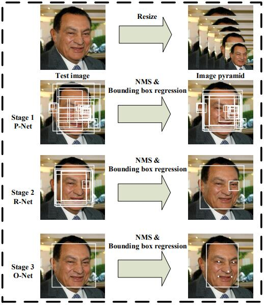

> ​	构建图像金字塔：首先，将图片进行不同程度的缩放，来构建图像金字塔，用于检测不同大小的人脸。主要由缩放系数factor进行，factor取值为0.709。简单来说，就是将图片长宽乘以0.709，直到长宽小于12。

> 2、P-Net，NMS

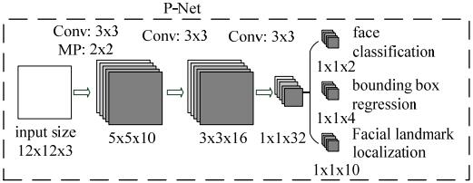

> ​	全称为Proposal Network，其基本的构造是一个全卷积网络。对上一步构建完成的图像金字塔，通过一个全卷积网络进行初步特征提取与标定边框，并进行Bounding-Box Regression调整窗口与NMS进行大部分窗口的过滤。

> 3、R-Net，NMS

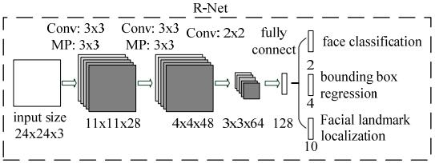

> ​	全称为Refine Network，其基本的构造是一个卷积神经网络，相对于第一层的P-Net来说，增加了一个全连接层，因此对于输入数据的筛选会更加严格。在图片经过P-Net后，会留下许多预测窗口，将所有的预测窗口送入R-Net，这个网络会滤除大量效果比较差的候选框，最后对选定的候选框进行Bounding-Box Regression和NMS进一步优化预测结果。R-Net使用在最后一个卷积层之后使用了一个128的全连接层，保留了更多的图像特征，准确度性能也优于P-Net。

> 4、O-Net，NMS

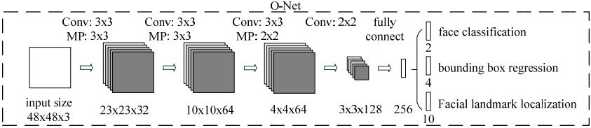

> ​	全称为Output Network，基本结构是一个较为复杂的卷积神经网络，相对于R-Net来说多了一个卷积层。O-Net的效果与R-Net的区别在于这一层结构会通过更多的监督来识别面部的区域，而且会对人的面部特征点进行回归，最终输出人脸面部特征点。

> （3）特征融合FPN结构

> （4）降低下采样与空洞卷积

### 5.	正负样本不均衡如何解决
> （1）数据样本方面：使用各种上采样、下采样方法

> （2）损失函数角度：比如增加样本少的类别的损失权重，减少样本多的类别的损失权重

### 6.	误检问题如何解决
> ​	训练负样本可降低误检率，收集负样本后，将正负样本数据及其标签作为训练集送入模型训练。负样本是指不包含任务所要识别的目标的图像，也叫负图像（Negtive Image)。以识别限速牌为例，如下所示，图1包含限速牌，为正样本，图2不包含限速牌，为背景图，即负样本。

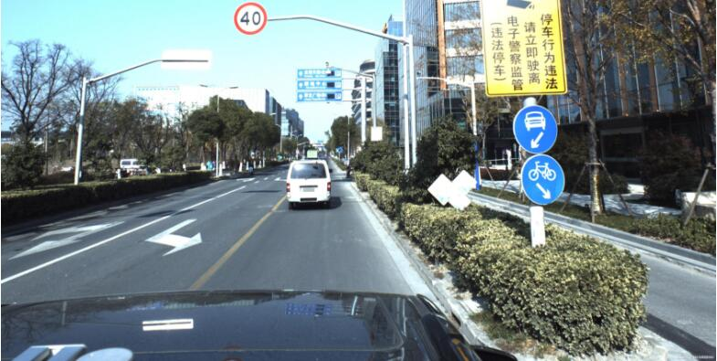

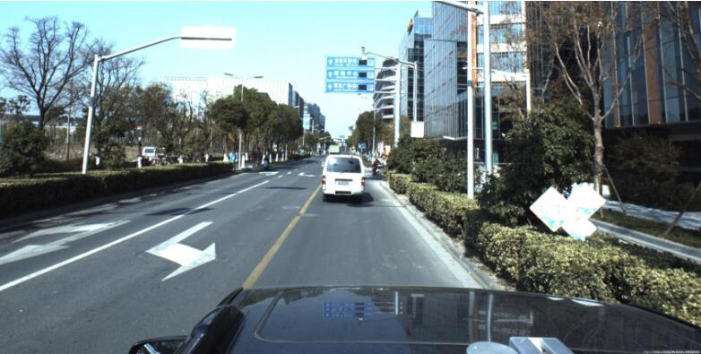

> ​	训练负样本的目的是为了降低误检测率、误识别率，提高网络模型的泛化能力。通俗地讲就是告诉检测器，这些“不是你要检测的目标”。可以通过下面两种方式收集负样本：采用本任务场景的不包含目标物体的背景图像，例如你的目标是识别某园区内的行人，那么所有本园区内不包含行人的图片都视作负样本。不要使用不属于本任务场景的负图像，因为其对检测器的性能影响不大。测试图像中被识别错误的目标所在区域。（通常对原图像进行裁剪，使得裁剪下来的图像只包含误识别的物体，而不包含目标）将正负样本集及其标签作为训练集送入模型训练即可。
> ​	正负样本必须放在一起训练，不能单独训练负样本，否则经过训练，网络会把所有的图像都识别为背景。正负样本的比例最好为1：1到1：2左右，数量差距不能太悬殊，特别是正样本数量本来就不太多的情况下。
> ​	尝试方法一：直接对误检的图像生成一个空的xml文件。（文件中没有任何对象）训练结果：由于xml文件中没有任何正样本对象，所以网络无法学习到背景信息，使用训练后的模型测试误检的图像，依然会产生误检。（这里网上有人说即使没有正样本，SSD网络在训练时也会产生负样本，本人测试，当整幅图像没有任何正样本时，网络学习不到任何信息，训练时loss=0）
> ​	尝试方法二：误检的图像中含有正样本对象，但不是误检的类别。（例如：该图像中人物类别出现误检，但对该图像进行训练时只标注了一个汽车类别，而没有增加人物的正样本类别）训练结果：这种情况下，对网络进行训练时，会产生loss，并且训练后的模型，不会再把误检图像中的背景误检为人物。

### 7.	关于评价指标的问题
> ​	AP和mAP是图像分类任务中的评价方法。
> 1、首先使用训练好的模型获得所有测试样本的confideutnce score，每个类别（如person、car等）都会获得一组confidence score，假设现在共有20个测试样本，如下给出这20个样本的id、confidence score、真实标签ground truth label。

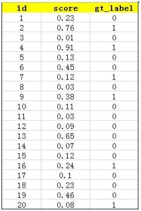

> 2、按照上图中的score值从大到小对所有样本进行排序，排序后结果如下图所示：

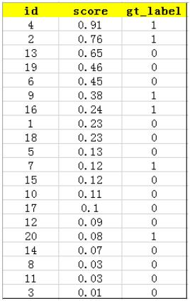

> 3、计算precision和recall值
> precision（精确率）：预测出的结果有多少是正确的
> recall（召回率）：正确的结果有多少被找给出来了

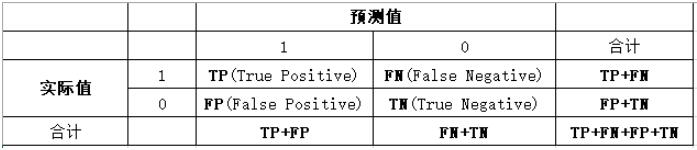

> 用（True Positive+False Positive）来表示分类任务中我们取出来的结果，如在测试集上取出Top-5的结果为：

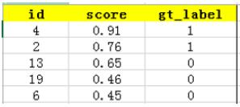

> 其中id为4和2的样本图片为True Positive，id为13、19、6的样本为False Positive。剩余排在Top-5之外的元素时我们没有取出来的。如下：

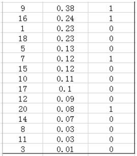

> 这个例子中precision=2/5，recall=2/6，实际的任务中通常不会满足只用Top-5来衡量模型的好坏。

> 4、计算AP：设总数为N的样本中总共有M个正样本，则从Top-1至Top-N可以有M个recall值，分别为（1/M,2/M,...,M/M），对于每个recall值r，可以从对应的（r'>=r）中计算出一个最大的precision，对这M个precision求平均得到AP，如下图所示：

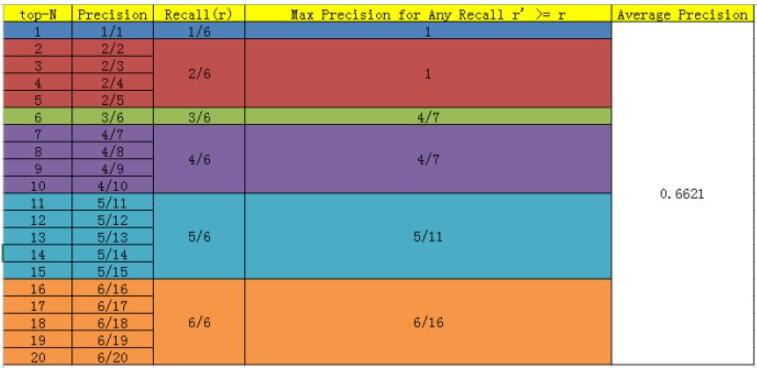

> 在上图所示中，共有6个正例，因此共有6个recall值，分别为1/6、2/6、3/6、4/6、5/6、6/6。
> 当recall=1/6时，r'为1/6、2/6、3/6、4/6、5/6、6/6，最大的precision=1；
> 当recall=2/6时，r'为2/6、3/6、4/6、5/6、6/6，最大的precision=2/2=1；
> 当recall=3/6时，r'为3/6、4/6、5/6、6/6，最大的precision=4/7；
> 当recall=4/6时，r'为4/6、5/6、6/6，最大的precision=4/7；
> 当recall=5/6时，r'为5/6、6/6，最大的precision=5/11；
> 当recall=6/6时，r'为6/6，最大的precision=6/16。
> 此时AP表示训练出来的模型在当前类别上的好坏，**AP其计算结果为上述求和取平均**。

> 5、计算mAP：按照上述步骤对每个类别都计算出AP，求均值得到mAP。

